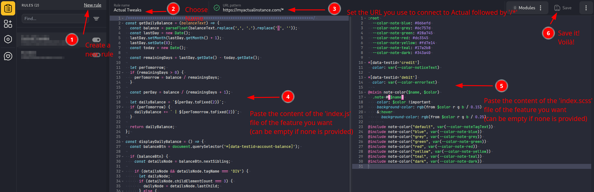

# How to install Userscripts

## prerequisites
First things first, install [User JS and CSS](https://tenrabbits.github.io/user-js-css-docs/) browser extension to use userscripts and userstyles.

You can use any userscript/userstyle extension (Tampermonkey, Stylish, etc.) but the one linked has the advantage to allow both JS and CSS/SCSS customization in a single extension.

## Installing a script
for detailled explanation, check the [official documentation of the extension](https://tenrabbits.github.io/user-js-css-docs/doc)

To install one the the script provided, follow the steps from the image below:
