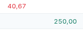
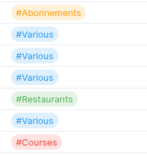

# actual-userscripts
Collection of Actual JavaScript/CSS Userscripts  
Tested with https://tenrabbits.github.io/user-js-css-docs/  
Contributions are welcome!

## actual-amountcolors
Show payments in red, deposit in green.

## actual-daily
Display how much money is available per day until the end of the month (starting today and tomorrow) next to the balance amount.

## actual-tagcolors
Allow user defined colors for tags.  
Colors must be defined in the `NOTES_COLORS` variables.  
Some colors are already defined in the CSS file, more can be added.

